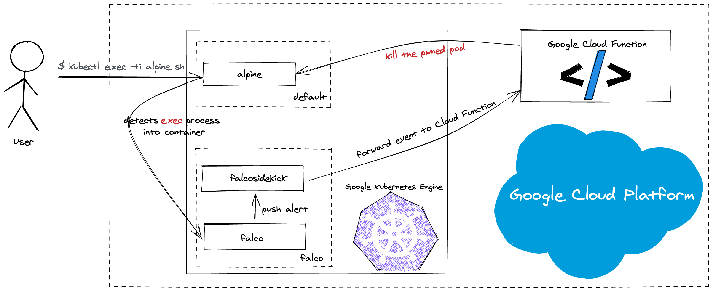

# Kubernetes Respons Engine on GKE by using Google Cloud Functions, Falco and Falcosidekick



> Similar: https://github.com/developer-guy/google-cloud-function-stdout-falco-alert

This demo demonstrates how to set up Kubernetes Response Engine on GKE by using Google Cloud Functions, Falco and Falcosidekick

## Prerequisites

* gcloud 342.0.0

## Tutorial

### 1. Create a Cluster

We need to create a GCP cluster with workload identity enabled

```bash
$ GOOGLE_PROJECT_ID=$(gcloud config get-value project)
$ CLUSTER_NAME=falco-falcosidekick-demo
$ gcloud container clusters create $CLUSTER_NAME \
                   --workload-pool ${GOOGLE_PROJECT_ID}.svc.id.goog
$ gcloud container clusters get-credentials $CLUSTER_NAME
```

### 2. Deploy Google Cloud Function

```bash
$ git clone https://github.com/Dentrax/kubernetes-response-engine-based-on-gke-and-gcloudfunctions.git
$ cd kubernetes-response-engine-based-on-gke-and-gcloudfunctions
$ FUNCTION_NAME=KillThePwnedPod
$ gcloud functions deploy $FUNCTION_NAME --runtime go113 --trigger-http
Allow unauthenticated invocations of new function [KillThePwnedPod]? (y/N)? N
...
```

Get the name of the function
```bash
$ CLOUD_FUNCTION_NAME=$(gcloud functions describe --format=json $FUNCTION_NAME | jq -r '.name')
```

Then install the `Falco` and `Falcosidekick` enabled with `Google Cloud Functions` output type.

```bash
$ export FALCO_NAMESPACE=falco
$ kubectl create namespace $FALCO_NAMESPACE
$ helm upgrade --install falco falco \
--namespace $FALCO_NAMESPACE \
--set ebpf.enabled=true \
--set falcosidekick.enabled=true \
--set falcosidekick.config.gcp.cloudfunctions.name=${CLOUD_FUNCTION_NAME} \
--set falcosidekick.webui.enabled=true
```

Finally set up the your SA and Rolebindings
```bash
$ SA_ACCOUNT=falco-falcosidekick-sa
$ gcloud iam service-accounts create $SA_ACCOUNT

$ gcloud projects add-iam-policy-binding ${GOOGLE_PROJECT_ID} \
--member="serviceAccount:${SA_ACCOUNT}@${GOOGLE_PROJECT_ID}.iam.gserviceaccount.com" \
--role="roles/cloudfunctions.developer"

$ gcloud projects add-iam-policy-binding ${GOOGLE_PROJECT_ID} \
--member="serviceAccount:${SA_ACCOUNT}@${GOOGLE_PROJECT_ID}.iam.gserviceaccount.com" \
--role="roles/cloudfunctions.invoker"

$ gcloud iam service-accounts add-iam-policy-binding \
  --role roles/iam.workloadIdentityUser \
  --member "serviceAccount:${GOOGLE_PROJECT_ID}.svc.id.goog[${FALCO_NAMESPACE}/falco-falcosidekick]" \
  ${SA_ACCOUNT}@${GOOGLE_PROJECT_ID}.iam.gserviceaccount.com
```

Finally set up the Falcosidekick SA to impersonate a GCP SA
```bash
$ kubectl annotate serviceaccount \
  --namespace $FALCO_NAMESPACE \
  falco-falcosidekick \
  iam.gke.io/gcp-service-account=${SA_ACCOUNT}@${GOOGLE_PROJECT_ID}.iam.gserviceaccount.com
```


### Creating Pod Destroyer Role

1. Create the ClusterRoleBinding

```bash
$ kubectl create serviceaccount pod-destroyer
$ kubectl create clusterrole pod-destroyer --verb=delete --resource=pod  # give only pod resource access for delete op 
$ kubectl create clusterrolebinding pod-destroyer --clusterrole pod-destroyer --serviceaccount default:pod-destroyer
```

2. Copy the Token from ServiceAccount

```bash
$ kubectl get secrets $(kubectl get serviceaccounts pod-deleter -o json | jq -r '.secrets[0].name') -o json | jq -r '.data.token' | base64 -D | pbcopy
```

3. Add `pod-destroyer` user to your _KUBECONFIG_

```yaml
apiVersion: v1
kind: Config
clusters:
- cluster:
    certificate-authority-data: XXX
    server: https://XX.XX.XX.XXX
  name: gke_falcosidekick-demo
contexts:
- context:
    cluster: gke_falcosidekick-demo
    namespace: default
    user: pod-destroyer
  name: gke_falcosidekick-demo
current-context: gke_falcosidekick-demo
users:
- name: pod-destroyer
  user:
    token: $POD_DESTROYER_TOKEN
```

4. _(OPTIONAL)_ Test with [auth can-i](https://kubernetes.io/docs/reference/access-authn-authz/authorization/#checking-api-access) to check if roles are set correctly

```bash
$ kubectl auth can-i list deployments  # no
$ kubectl auth can-i delete pod  # yes
$ kubectl access-matrix  # github.com/corneliusweig/rakkess
```

### Test

Create an alpine pod first, then try to exec into it.

```bash
$ kubectl run alpine --image=alpine --restart='Never' -- sh -c "sleep 600"
```

Exec into it.
```bash
$ kubectl exec -i --tty alpine -- sh -c "uptime"
```
