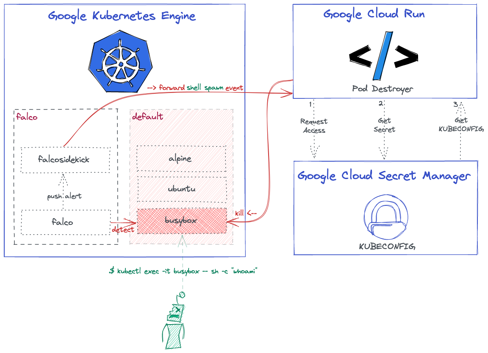
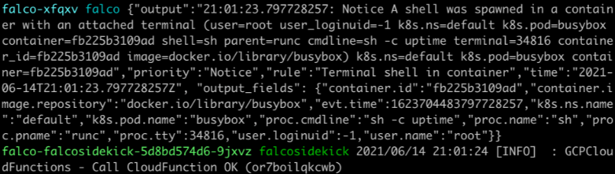

# Kubernetes Respons Engine on GKE by using Google Cloud Functions, Falco and Falcosidekick

Here is the high-level overview architecture that shows what we want to achieve:



> Similar: https://github.com/developer-guy/google-cloud-function-stdout-falco-alert
Here is the high-level overview architecture that shows what we want to achieve at the end of the day:

## Prerequisites

- gcloud 342.0.0
- kubectl 1.20.5

## Tutorial

### Provision Google Kubernetes Engine (GKE) Cluster

As the blog title said already, we need to create a [GKE cluster](https://cloud.google.com/kubernetes-engine) with workload identity enabled:

```shell
$ GOOGLE_PROJECT_ID=$(gcloud config get-value project)
$ CLUSTER_NAME=falco-falcosidekick-demo
$ gcloud container clusters create $CLUSTER_NAME --workload-pool ${GOOGLE_PROJECT_ID}.svc.id.goog
$ gcloud container clusters get-credentials $CLUSTER_NAME
```

### Configuring IAM Service Accounts

We need to create a new [Service Account](https://cloud.google.com/iam/docs/service-accounts) for target `$GOOGLE_PROJECT_ID` using IAM Binding [policies](https://cloud.google.com/iam/docs/policies) to get access our Cloud Function:
```shell
$ SA_ACCOUNT=falco-falcosidekick-sa
$ gcloud iam service-accounts create $SA_ACCOUNT

$ gcloud projects add-iam-policy-binding ${GOOGLE_PROJECT_ID} \
--member="serviceAccount:${SA_ACCOUNT}@${GOOGLE_PROJECT_ID}.iam.gserviceaccount.com" \
--role="roles/cloudfunctions.developer"

$ gcloud projects add-iam-policy-binding ${GOOGLE_PROJECT_ID} \
--member="serviceAccount:${SA_ACCOUNT}@${GOOGLE_PROJECT_ID}.iam.gserviceaccount.com" \
--role="roles/cloudfunctions.invoker"
```

At the beginning, we already enabled [WorkloadIdentity](https://cloud.google.com/kubernetes-engine/docs/how-to/workload-identity) feature for our GKE Cluster by setting `--workload-pool` flag. What we need to do here is we should add a `iam.workloadIdentityUser` role for the given Service Account.

```bash
$ gcloud iam service-accounts add-iam-policy-binding \
  --role roles/iam.workloadIdentityUser \
  --member "serviceAccount:${GOOGLE_PROJECT_ID}.svc.id.goog[${FALCO_NAMESPACE}/falco-falcosidekick]" \
  ${SA_ACCOUNT}@${GOOGLE_PROJECT_ID}.iam.gserviceaccount.com
```

We need to _annotate_ the `falco-falcosidekick` resource. So it can grant access for our Cluster. Set up the Falcosidekick SA to impersonate a GCP SA:
```bash
$ kubectl annotate serviceaccount \
  --namespace $FALCO_NAMESPACE \
  falco-falcosidekick \
  iam.gke.io/gcp-service-account=${SA_ACCOUNT}@${GOOGLE_PROJECT_ID}.iam.gserviceaccount.com
```

### Create Necessary Cluster Role

To limit function role access in the particular cluster, we need to ensure our SA only have limited permissions within a particular namespace by using [Role Bindings](https://kubernetes.io/docs/reference/access-authn-authz/rbac/#rolebinding-and-clusterrolebinding). It should only access _Pod_ resource for _DELETE_ action:

```bash
$ kubectl create serviceaccount pod-destroyer
$ kubectl create clusterrole pod-destroyer 
  --verb=delete 
  --resource=pod  # give only pod resource access for delete op 
$ kubectl create clusterrolebinding pod-destroyer 
  --clusterrole pod-destroyer 
  --serviceaccount default:pod-destroyer
```

To obtain the Token from secret, we need to get `pod-deleter` ServiceAccount resource first:

```bash
$ POD_DESTROYER_TOKEN=$(kubectl get secrets $(kubectl get serviceaccounts pod-deleter -o json \
  | jq -r '.secrets[0].name') -o json \
  | jq -r '.data.token' \
  | base64 -D)
```

Add the `pod-destroyer` user to your _KUBECONFIG_:

```bash
# Generate your KUBECONFIG
$ kubectl config view  --minify --flatten > kubeconfig_pod-destroyer.yaml

# Set the token at the end of yaml
$ cat << EOF >> kubeconfig_pod-destroyer.yaml
users:
- name: user.name
  user:
    token: $POD_DESTROYER_TOKEN
```

We can test it with [auth can-i](https://kubernetes.io/docs/reference/access-authn-authz/authorization/#checking-api-access) to check if roles are set correctly
```bash
$ kubectl auth can-i list deployments  # no
$ kubectl auth can-i delete pod  # yes
$ kubectl access-matrix  # github.com/corneliusweig/rakkess
```

### Create Secret Manager

Where Secret Manager get involved our architecture is we had to find a way out to initialize our _kubeclient_ in our function. Simply, we need to store our `pod-destroyer`'s _KUBECONFIG_ and access from the function.

We need to create a new _secrets IAM policy_ for the SA member to enable [Managing Secrets](https://cloud.google.com/secret-manager/docs/managing-secrets):

```bash
$ gcloud secrets add-iam-policy-binding pod-destroyer \
    --role roles/secretmanager.secretAccessor \
    --member serviceAccount:$SA_ACCOUNT@$GOOLE_PROJECT_ID.iam.gserviceaccount.com
```

Create a new secret, called `pod-destroyer`:

```bash
$ gcloud secrets create pod-destroyer --replication-policy="automatic"
```

Push the our generated `kubeconfig_pod-destroyer.yaml` file as a new version:

```bash
$ gcloud secrets versions add pod-destroyer --data-file=kubeconfig_pod-destroyer.yaml
```

Finally, we are ready to deploy our Cloud Run function!

### Deploy Google Cloud Function

In this demonstration our function will simply _delete the pwned Pod_, as we already pointed it out in the architecture diagram.

You can find the [Go code](./main.go) here.

```shell
$ git clone https://github.com/Dentrax/kubernetes-response-engine-based-on-gke-and-gcloudfunctions.git
$ cd kubernetes-response-engine-based-on-gke-and-gcloudfunctions
...
```

We need to pass extra `--service-account` flag in order to get access to Secret Manager.

Deploy the function:
```shell
$ FUNCTION_NAME=KillThePwnedPod
$ gcloud functions deploy $FUNCTION_NAME \
--runtime go113 --trigger-http \
--service-account $SA_ACCOUNT@$GOOLE_PROJECT_ID.iam.gserviceaccount.com
Allow unauthenticated invocations of new function [KillThePwnedPod]? (y/N)? N
...
```

Now, get the name of the function:
```shell
$ CLOUD_FUNCTION_NAME=$(gcloud functions describe --format=json $FUNCTION_NAME | jq -r '.name')
```

### Install Falco + Falcosidekick

It is time to install `Falco`, `Falcosidekick` with `Cloud Function` output type enabled:

```shell
$ export FALCO_NAMESPACE=falco
$ kubectl create namespace $FALCO_NAMESPACE
$ helm upgrade --install falco falcosecurity/falco \
--namespace $FALCO_NAMESPACE \
--set ebpf.enabled=true \
--set falcosidekick.enabled=true \
--set falcosidekick.config.gcp.cloudfunctions.name=${CLOUD_FUNCTION_NAME} \
--set falcosidekick.webui.enabled=true
```

### Test

Try to run a busybox image and execute a command:
```shell
$ kubectl run busybox --image=busybox --restart='Never' -- sh -c "sleep 600"
```

Try to exec into:
```shell
$ kubectl exec -it busybox -- sh -c "uptime"
```

Check the logs of the `Falco`, and `Falcosidekick` to see what happened:



For `Falcosidekick`:

```shell
$ kubectl logs deployment/falco-falcosidekick --namespace falco
2021/06/14 21:01:24 [INFO]  : GCPCloudFunctions - Call Cloud Function OK
..
```